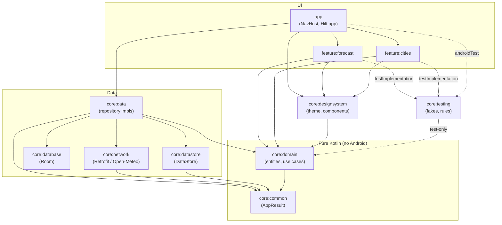

# Weather Forecast App

An Android weather forecast app built for the ON Android Engineer home assignment.

<p>
  <em>Today's weather &amp; 7-day forecast · City list with search-to-add · Powered by Open-Meteo</em>
</p>

## Features

- **Today's forecast** — current temperature, condition, feels-like, humidity, wind, sunrise/sunset, and the upcoming 24 hours with rain probability
- **Weekly forecast** — 7-day outlook with condition, rain probability and min/max temperatures
- **Air quality** — European AQI band with colour coding and PM2.5
- **City list** — 5 preloaded cities, search any city worldwide (Open-Meteo geocoding), add/remove/select; the selected city persists across launches
- **Works offline** — the last forecast per city is cached and shown instantly, clearly labelled as cached
- **Recovers on its own** — connectivity is monitored; regaining it retries a failed load with no user action
- **Pull to refresh**, plus a persistent error banner with an inline Retry
- **English / 繁體中文** UI switch and **°C / °F** toggle, both persisted

## Tech Stack & Why

Each choice was made against at least one concrete alternative:

| Area | Chosen | Alternatives considered | Why this one |
|---|---|---|---|
| Network | Retrofit + OkHttp | Ktor Client | Declarative API interfaces, mature interceptor ecosystem, and first-class MockWebServer testing. Ktor's main edge is Kotlin Multiplatform, which this Android-only project doesn't need. |
| JSON | kotlinx.serialization | Moshi, Gson | Compile-time codegen — no reflection, and Kotlin nullability/default values are actually enforced. Gson bypasses Kotlin null-safety via reflection (a real production bug source); Moshi is solid but adds a second codegen pipeline for no gain here. |
| DI | Hilt | Koin, manual DI | Graph validated **at compile time** — a missing binding fails the build, not the user session. Standard ViewModel/Navigation integration and `@TestInstallIn` made the E2E test doubles trivial. Koin resolves at runtime (errors surface late); manual DI doesn't scale across 11 modules. |
| Local DB | Room | SQLDelight, raw SQLite | Compile-time verified SQL, `Flow` queries, in-memory builder for tests, and a `Callback` hook that made seeding default cities clean. SQLDelight is excellent but its main advantage (KMP) is unused here. |
| Preferences | DataStore | SharedPreferences | Async `Flow`-based reads, transactional writes, no main-thread I/O. SharedPreferences has sync reads that can ANR and racy `apply()` semantics. |
| Concurrency | Coroutines + Flow | RxJava | Structured concurrency (cancellation propagates with lifecycles — see the search-cancellation handling in `CitiesViewModel`), and first-party support in Room/Retrofit/Compose. RxJava solves the same problems with a much larger API surface. |
| Connectivity | `ConnectivityManager.NetworkCallback` wrapped in `callbackFlow` | Polling, or checking only at request time | Push-based: the app reacts the moment connectivity returns instead of waiting for the user to retry. `callbackFlow` + `awaitClose` unregisters the callback with the subscription, so there is no leak. |
| Per-app language | Platform `LocaleManager` (API 33+) with the AppCompat backport below | Manually wrapping `Context` with a custom `Configuration` | The system persists the choice, recreates activities, and exposes it in Android's per-app language settings. Context wrapping has to be repeated in every entry point and misses resources loaded outside activities. |
| Cache payload | `kotlinx.serialization` mirror classes in `core:data` | Room `@TypeConverter`s, or annotating the domain models | Keeps `@Serializable` out of `core:domain` (which must stay pure Kotlin), and lets the payload format evolve without a schema migration. |
| Presentation | MVVM + UDF (plain `StateFlow`) | MVI frameworks (Orbit, Circuit) | The unidirectional pattern without framework lock-in: UI observes one `StateFlow<UiState>`, events go back as function calls. At this scope an MVI framework adds concepts without adding safety. |
| Build | Convention plugins (`build-logic`) + version catalog | `buildSrc`, copy-pasted module scripts | One source of truth for SDK levels/Java target/test deps across 11 modules. Unlike `buildSrc`, an included build doesn't invalidate the entire build cache on every change. |
| Unit test doubles | MockK + hand-written fakes | Mockito | MockK is Kotlin-native: final classes work out of the box and `coEvery`/`coVerify` handle suspend functions. Stateful fakes (in `core:testing`) are used where interaction mocks would just mirror the implementation. |
| API | Open-Meteo | OpenWeatherMap | No API key → the "100% executable" requirement holds for any reviewer from a clean clone, with no secret management. Its geocoding API also shares GeoNames ids with the forecast API, enabling natural upserts. |

## Module Dependency Graph



Key properties: all arrows point **inward** toward the pure-Kotlin domain; features never depend on
each other or on data sources directly (repository *interfaces* live in `core:domain`, their
*implementations* in `core:data`, bound together by Hilt in `app`); `core:designsystem` and
`core:testing` are horizontal support modules.

## Module Structure

```
├── app                     # App shell: MainActivity, NavHost, Hilt application
├── build-logic             # Gradle convention plugins shared by all modules
├── core
│   ├── common              # Pure Kotlin: AppResult/AppError, DispatcherProvider
│   ├── domain              # Pure Kotlin: entities, repository interfaces, use cases
│   ├── network             # Retrofit APIs + DTOs for Open-Meteo (forecast & geocoding)
│   ├── database            # Room: saved cities (seeded with 5 defaults)
│   ├── datastore           # DataStore: selected city preference
│   ├── data                # Repository implementations + DTO/entity mappers
│   ├── designsystem        # Theme, shared composables, weather icon mapping
│   └── testing             # Fakes, MainDispatcherRule, HiltTestRunner, fixtures
└── feature
    ├── forecast            # Today + weekly forecast screen (feature module)
    └── cities              # City list / search / manage screen (feature module)
```

Dependency rule: `feature → core:domain / core:designsystem`, `core:data → network/database/datastore`,
and `core:domain` stays free of Android dependencies. UI observes `StateFlow<UiState>` from
ViewModels; use cases encapsulate business rules (e.g. selection fallback, search query guard,
selection reassignment on delete).

## API

[Open-Meteo](https://open-meteo.com/) — free, **no API key required**, so the project runs
straight from a clean clone:

- Forecast: `api.open-meteo.com/v1/forecast` (current + hourly + daily, WMO weather codes)
- City search: `geocoding-api.open-meteo.com/v1/search`

## Getting Started

Requirements: Android Studio (AGP 9.x / JDK 17+ via toolchain), Android SDK 37.

```bash
git clone <this repo>
./gradlew :app:installDebug   # or open in Android Studio and Run
```

No configuration or API key needed.

## Testing

```bash
./gradlew test                        # ~85 unit tests (JVM + Robolectric)
./gradlew connectedDebugAndroidTest   # 3 E2E scenarios (needs emulator/device)
./gradlew build                       # full build incl. lint + unit tests
```

Room ships **schema version 2** with an explicit `Migration(1, 2)` (adding the forecast cache
table) and a migration test that proves saved cities survive the upgrade — destructive fallback
is deliberately not used.

### Seeing per-test results in the console

Every unit test prints its name and outcome (`ClassName > test name PASSED/FAILED`) while
running. Gradle skips test tasks whose inputs didn't change (`UP-TO-DATE`) — nothing executes,
so nothing is printed. To force a fresh run and see the full list again:

```bash
./gradlew test --rerun-tasks
```

Connected (E2E) tests print the same per-test summary right after the device run finishes
(the `printConnectedTestResults` task parses the XML reports). Full HTML reports are written
to `app/build/reports/androidTests/connected/` and `<module>/build/reports/tests/`.

### E2E screenshots

Every E2E test captures a device screenshot when it finishes (pass **and** fail, via
`ScreenshotOnTestFinishedRule` + androidx test storage). After
`./gradlew connectedDebugAndroidTest`, AGP pulls them to:

```
app/build/outputs/connected_android_test_additional_output/debugAndroidTest/connected/<device>/
  ├── displaysTodayAndWeeklyForecastForDefaultCity_PASSED.png
  ├── addsCityViaSearchAndShowsItsForecast_PASSED.png
  └── switchesSelectedCityFromSavedList_PASSED.png
```

They stay on disk until the next test run overwrites them (or `./gradlew clean`).

> **Note:** when `connectedDebugAndroidTest` finishes, AGP **uninstalls the app and test APKs
> from the device by design** (test hygiene). If the launcher icon disappears after running
> E2E tests, just reinstall with `./gradlew installDebug`.

- **Unit**: domain use cases, WMO code mapping, DTO/entity mappers, repository error mapping,
  DAO (Robolectric in-memory), DataStore, ViewModels (Turbine + fakes), API deserialization
  (MockWebServer)
- **E2E**: Kaspresso + Compose semantics against an on-device MockWebServer with Hilt
  `@TestInstallIn` modules (in-memory DB per test, unique DataStore file, mocked base URLs)

## Design Decisions

- **GeoNames ids as primary keys**: seeded cities and geocoding results share the same id space,
  so re-adding an existing city is a natural upsert.
- **Selection fallback in domain**: if the user never picked a city, the first saved city is
  shown; deleting the selected city moves selection to the next one — both covered by unit tests.
- **Convention plugins**: single source of truth for compileSdk/minSdk/Java target/test deps
  across 11 modules.
- **Offline-first, not offline-only**: cached data renders immediately and is explicitly marked
  stale, so the user always knows whether they are looking at live data.
- **Supplementary data fails quietly**: a failed air-quality request hides its card; only the
  forecast itself is allowed to surface an error.

## CI

Pull requests are reviewed automatically by Claude via
[`.github/workflows/claude.yml`](.github/workflows/claude.yml) (correctness, coroutine/Flow
lifecycle, module boundaries, Compose idioms, test quality). Commenting `@claude` on a PR
re-runs it on demand.

## AI Tools

This project was built with AI assistance — see [AI_TOOLS.md](AI_TOOLS.md) for the tools used
and how they helped.
